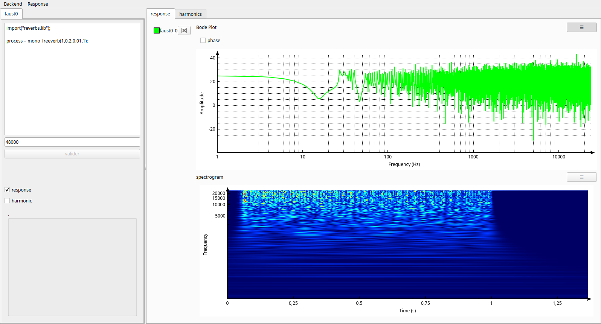
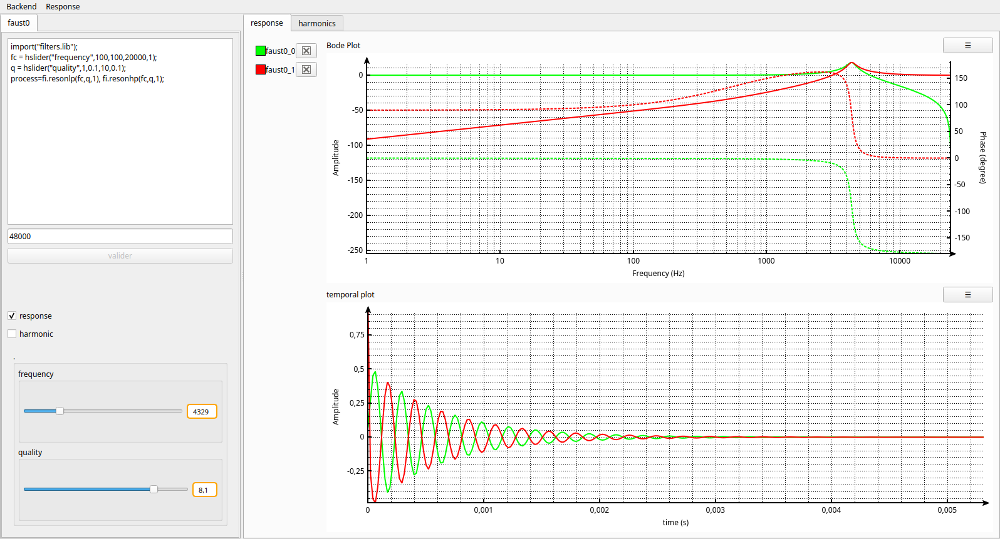
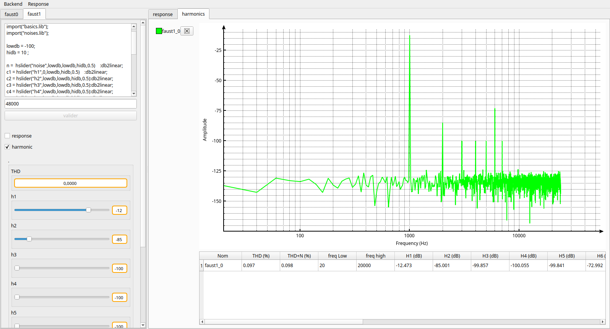

# ATSAHSNA

This project aims to be a free/libre software to perform accoustical measures.




 

 
It's licenced under GPLv3.

/!\ For now it's under heavy development, you can play with it but please dont build something with it yet.


What's already implemented:
- tree backend (faust, jackd, and soundfile)
- impulse/step response
- harmonic spectrum, THD computation (THD, THD+N, SNR)
- waterfall measures
    - using continuous wavelet
    - using short term fourier transform
- temporal response


Soon :
- export measurements in a bunch of standards files
- handling of several measures at once
- less franglish and proper translations

Regarding IO and data acquisition :
- dealing with several input/output (to measure two channels at once for instance)
  - mixing soundcards (for instance to test the input of one against the output of an other)
- simpler code (I am tâtonning)
- introduce arbitrary correction from input (like the inverse of a microphone response)
- more backends (C, C++, Python, something more standard like pulseaudio) 
- some tests for more trust in the computations.


to install and try (should works on Arch Linux at least) :
```
git submodule init
git submodule update
cmake -S . -B build && make -j 8 -C build
./build/ATSAHSNA 
```

Dependancy:
* FFTW
* fCWT (a continuous wavelet lib, in a git submodule, this lib itself also depends on FFTW)
* Faust
* Jack
* moodycamel lockfree queue (already in the repository)
* QCustomPlot (via cmake fetch)
* Catch2 (via cmake fetch)
* sndfiles

When I started this project, I didn't knew that one : https://github.com/mincequi/qLouder, you should check it out as well
